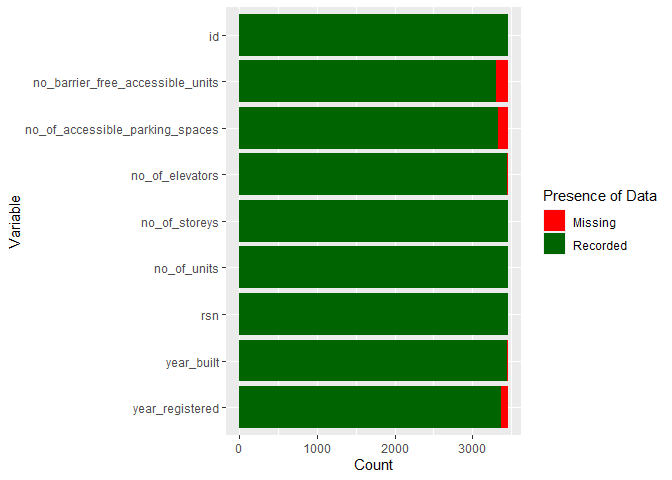
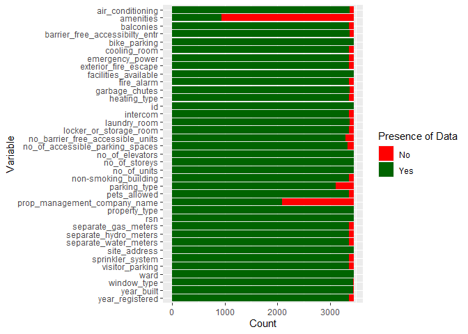
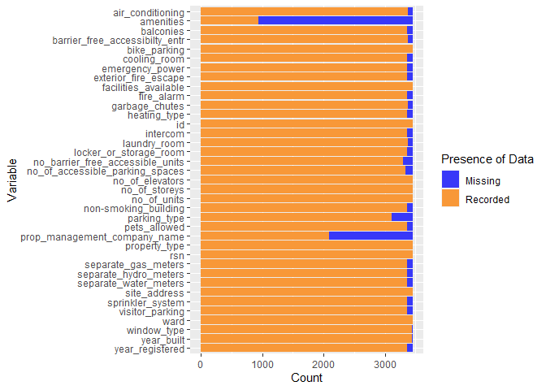
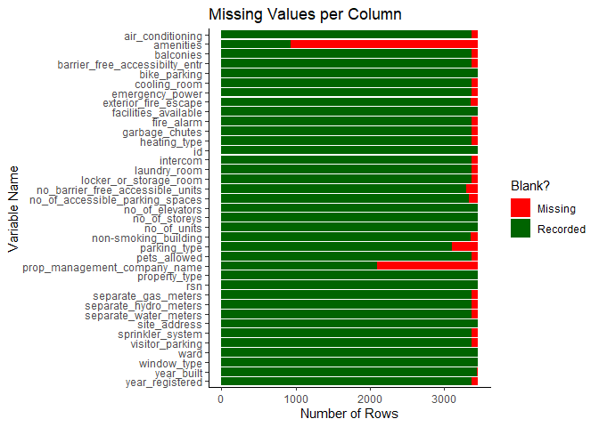
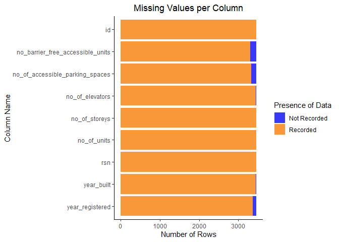

STAT 545B - Assignment B-1
================

# Introduction

The function which we are going to define is a particular function which
can be used for plotting the proportion of missing and recorded values
in each column of an R `tibble` object.

This function will product a column plot in ggplot (using the
`ggplot2::geom_col` function) with one column in the plot for each of
the selected columns in the R tibble.

# Setup

Because this function is designed to plot data from a `tibble` object,
and it utilizes the `ggplot2` package to create the plots, we will need
to import the `tidyverse` library, as it contains these two packages and
some additional packages such as `tidyr` and `magrittr` which are
helpful in working with tibbles.

In addition to the `tidyverse` family of packages, we will also utilize
the `datateachr` package to give examples of the function which we
define below, and we will use the `testthat` package to test whether the
outputs of the function are as expected.

``` r
library(tidyverse)
library(datateachr)
library(testthat)
```

# Function Definition

In the following code chunk, we will use R to create the function which
returns the desired plot. We will allow for certain levels of
customizability in the function, including the following: - Selecting
which columns from the dataset to have in the plot - Changing the
colours of the bars corresponding to missing and recorded values -
Changing the names of the bars which are shown in the legend -
Additional customization options which can be passed to `ggplot2` (this
is done using a `...` parameter)

In addition to the features described above, we will also define this
function in a manner that lets us use the pipe to call this function, as
opposed to requiring the dataset to be explicitly given to make this
function run. This can be advantageous as we can combine calling this
function with other features such as `mutate`, `join`, and `filter`
functions.

``` r
#' @title Plot counts of missing and recorded values in each selected column
#' 
#' @details This function returns a stacked column plot which depicts the number of missing (`NA`) and recorded (not `NA`) observations in each specified column of a tibble.
#' 
#' @param `.data` A tibble in R which contains data. This parameter is named `.data` because it is a generic name for a dataset, and this name matches the convention of other tidyverse functions. The `.` allows this function to be called using a pipe, as opposed to requiring the dataset to be explicitly given in the function call.
#' @param `...` A collection of additional graphical parameters which will be passed to `ggplot2`. This parameter gives us extra flexibility in creating the plots by dding desired graphical features after the creation of the "basic" plot.
#' @param `cols` <[`tidy-select`](https://tidyr.tidyverse.org/reference/tidyr_tidy_select.html)> The columns in `.data` which will be shown in the plot. This parameter is named `cols` because it is a selection of columns, and this name matches the convention of other tidyverse functions.
#' @param `count_names` A vector of two strings, which will be the names given to the counts of missing and recorded values, respectively. This parameter is named `count_names` because the two values in this vector are the names corresponding to the counts of missing and recorded values.
#' @param `bar_colours` A vector of two colour codes, which are used for depicting the missing and recorded values, respectively. For more information on valid colour codes, see `colors()`. This parameter is named `bar_colours` because that is the proper Canadian spelling, and because the two values in this vector are the colours in the plot which correspond to the missing missing and recorded values.
#' 
#' @return A stacked column plot displaying the number of missing and recorded observations in each column in `cols`, with the names given in `count_names`, the colours selected in `bar_colours`, and any additional graphical parameters which were provided in `...`.

plot_missing_observations <- function(.data, ..., cols = everything(),
                                      count_names = c("Missing", "Recorded"),
                                      bar_colours = c("red", "darkgreen")
                                      ){
  # Check that the provided dataset is a tibble
  if(!is_tibble(.data)){
    stop(paste("This function requires the provided dataset to be a tibble.",
               "The data which you provided is not in tibble format."))
  }

  # Check that count_names has exactly 2 values
  if(length(count_names) != 2){
    stop(paste("The names for the counts data must have exactly two values.",
               "You provided a list of", length(count_names), "names instead."))
  }

  # Check that bar_colours has exactly 2 values
  if(length(bar_colours) != 2){
    stop(paste("The colors for the counts data must have exactly two values.",
               "You provided a list of", length(bar_colours), "colors instead."))
  }
  
  # Extract the names and colours from the count_names and bar_colours arguments
  missing_data_name = count_names[1]
  recorded_data_name = count_names[2]
  missing_data_colour = bar_colours[1]
  recorded_data_colour = bar_colours[2]

  # Select only the desired columns from the dataset
  data_subset <- .data %>%
    select({{ cols }})
  
  # Create a new tibble with the counts of recorded and missing observations per column
  data_counts <- tibble(variable = colnames(data_subset),
                        {{ missing_data_name }} := colSums(is.na(data_subset)),
                        {{ recorded_data_name }} := colSums(!is.na(data_subset)))
  
  # Use pivot_longer to put the counts in one column
  data_counts <- data_counts %>%
    pivot_longer(cols = !variable, names_to = "presence", values_to = "count")
  
  # Turn presence"into a factor so that the count of recorded values is always
  # shown first (on the left) 
  data_counts <- data_counts %>%
    mutate(presence = factor(presence, levels = count_names))
  
  # Extract any additional ggplot parameters from the ellipsis
  ggplot_extra_params <- list(...)
  
  # Create the column plot to visualize the counts
  missing_data_plot <- data_counts %>%
    ggplot(aes(x = forcats::fct_rev(variable), y = count, fill = presence)) +
    geom_col(position = "stack") +
    scale_fill_manual(values = bar_colours) +
    labs(x = "Variable", y = "Count", fill = "Presence of Data") +
    coord_flip() +
    ggplot_extra_params # Add any extra parameters which were provided 
  
  # Return the plot which was constructed above
  return(missing_data_plot)
}
```

# Examples

Now that we have defined the function, we can go through several
examples of calling this function on an actual dataset to see how the
parameters of this function affect the graphical outputs.

To do this, we will use the `apt_buildings` dataset from the
`datateachr` R package.

``` r
# Use datateachr to get a dataset
apartments <- datateachr::apt_buildings
```

## Basic Function Call

First, we will display an “elementary” call of this function, which uses
all of the default parameters that are provided in the function and no
additional graphical parameters.

``` r
# Call the function by itself
plot_missing_observations(apartments)
```

<!-- -->

We can see that the plot above shows the counts of missing and recorded
values for each column in the `apt_buildings` dataset.

## Calling the Function with Pipes

Next, we will display how we can use a pipe (`|>` or `%>%`) to call this
function. Because the `|>` pipe is only available in newer R versions,
we will use the `%>%` pipe from the `magrittr` library.

``` r
# Call the function with a pipe instead of passing .data as a parameter directly
apartments %>%
  plot_missing_observations()
```

<!-- -->

The plot shown above looks identical to the first plot which was
generated, even though the `plot_missing_observations` function was
called using a pipe instead of as a “standalone” line of code.

## Selecting Columns

Next, we will look at subsetting columns of the data with the `cols`
parameter. We will select only the columns which contain numeric data,
and we will call this function on that subset of the `apt_buildings`
dataset.

``` r
# Select a subset of the columns
plot_missing_observations(apartments, cols = where(is.numeric))
```

<!-- -->

## Renaming the bars in the legend

Using the `count_names` parameter, we can rename the bars in the legend
from their default names (“Missing” and “Recorded”) to a different set
of names.

``` r
# Change the names for the bars which are displayed in the legend
plot_missing_observations(apartments, count_names = c("No", "Yes"))
```

<!-- -->

## Changing the colours of the bars

Using the `bar_colours` parameter, we can change the colours of the
bars. We can use hex codes (as shown below) or default colour names \`to
declare these colours.

``` r
# Change the colours of the bars
plot_missing_observations(apartments, bar_colours = c("#3838F8", "#F89838"))
```

<!-- --> \## Using
the ellipses

We can use the ellipses to pass additional arguments into `ggplot2` when
we are creating the plots. Two possible examples of additional ggplot
parameters which we can add to the plot are a theme, and renaming the
axes, legend, and title.

``` r
# Use additional arguments to change things in the plot
plot_missing_observations(apartments, theme_classic(), 
                          labs(x = "Variable Name", y = "Number of Rows", fill = "Blank?",
                               title = "Missing Values per Column"))
```

<!-- -->

## Throwing errors

The function which we defined only works when the dataset provided is a
tibble, and when the `count_names` and `bar_colours` variables both have
precisely 2 elements.

Before the function creates the plots, we first check that these three
requirements are all satisfied, and the function throws an error if any
of these conditions are violated.

``` r
# Call the function with 3 count_names. This should throw an error.
plot_missing_observations(apartments, count_names = c("Missing", "Recorded", "Quantum Superposition"))
```

    ## Error in plot_missing_observations(apartments, count_names = c("Missing", : The names for the counts data must have exactly two values. You provided a list of 3 names instead.

We see that this call to our function throws an error, which is good, as
the `count_names` vector provided had 3 values instead of 2.

## Putting it all together

Finally, we can combine the many features shown above to have a wide
range of customization in the plots which are generated by this
function.

``` r
# Use all the features at once
apartments %>%
  plot_missing_observations(theme_classic(), 
                            labs(x = "Column Name", y = "Number of Rows", 
                                 title = "Missing Values per Column"),
                            theme(plot.title = element_text(hjust = 0.5)),
                            cols = where(is.numeric),
                            count_names = c("Not Recorded", "Recorded"),
                            bar_colours = c("#3838F8", "#F89838"))
```

<!-- -->

# Function Testing

Now that we have seen an overview of the capabilities of the function,
we can use the `testthat` library to ensure that the outputs of the
function are as expected.

## Testing for Thrown Errors

First, we will test that the function gives an error whenever any of the
three required conditions of the function (`.data` is a tibble,
`count_names` has two values, `bar_colours` has two values) are
violated.

``` r
test_that("Function throws errors when the conditions are violated", {
  # .data is not a tibble
  expect_error(plot_missing_observations(as.data.frame(apartments)))
  
  # count_names does not have exactly two values
  expect_error(plot_missing_observations(apartments, 
                                         count_names = c("Missing", "Recorded", 
                                                         "another secret third thing")))
  
  # bar_colours does not have exactly two values
  expect_error(plot_missing_observations(apartments, 
                                         bar_colours = c("red", "green", "white")))
  
  # bar_colours and count_names both do not have exactly two values
  expect_error(plot_missing_observations(apartments,
                                         count_names = c("Missing", "Recorded",
                                                         "another secret third thing"),
                                         bar_colours = c("red", "green", "white")))
})
```

    ## Test passed 🥇

## Testing for Altering the Dataset

Next, we will test whether the function alters the dataset `.data` which
is a parameter of the function. We will test whether the function alters
the dataset when we pass `.data` as a parameter directly, and when we
call our function using the pipe.

To test whether the data is altered by our function, we will use a new
dataset called `flow_sample`, which is also from the `datateachr`
library.

``` r
# Get three copies of the flow_sample dataset from datateachr
flow_1 <- datateachr::flow_sample # Passed directly as a parameter to the function
flow_2 <- datateachr::flow_sample # Piped into the function
flow_3 <- datateachr::flow_sample # A third copy which is used as a "reference"

# Call the function by passing a copy of the flow_sample dataset as a parameter
flow_plot_1 <- plot_missing_observations(flow_1)

# Call the function using the pipe
flow_plot_2 <- flow_2 %>%
  plot_missing_observations()

test_that("Using the function does not alter the actual dataset", {
  # Check that all three flow datasets are still equivalent after
  expect_identical(flow_1, flow_2)
  expect_identical(flow_1, flow_3)
  expect_identical(flow_2, flow_3)
})
```

    ## Test passed 🥳

## Test that `cols` and `...` yield expected results

Lastly, we are going to test that the `cols` parameter and additional
graphical parameters passed to `...` provide the same results as if we
were to use `select` and add additional graphical parameters to the plot
manually after the function returns.

To do this, we will use the `steam_games` dataset, which is also from
the `datateachr` library.

``` r
steam <- datateachr::steam_games

# Create a plot using select and adding additional graphics manually
steam_missing_obs_1 <- steam %>%
  # Any column which starts with a vowel 
  select(matches('^[aeiou].*')) %>%
  plot_missing_observations()

# Add a title and a theme manually
steam_missing_obs_1 <- steam_missing_obs_1 +
  theme_classic() +
  labs(title = "Count of Missing Observations by Column")

# Do these directly via the function's parameters
steam_missing_obs_2 <- steam %>%
  plot_missing_observations(theme_classic(), 
                            labs(title = "Count of Missing Observations by Column"),
                            cols = matches("^[aeiou].*"))

test_that("The two plots which are generated are the same", {
  # Check that the mappings are all the same
  expect_true(rlang::get_expr(steam_missing_obs_1$mapping$x) == 
                rlang::get_expr(steam_missing_obs_2$mapping$x))
  expect_true(rlang::get_expr(steam_missing_obs_1$mapping$y) == 
                rlang::get_expr(steam_missing_obs_2$mapping$y))
  expect_true(rlang::get_expr(steam_missing_obs_1$mapping$fill) == 
                rlang::get_expr(steam_missing_obs_2$mapping$fill))
  
  # Check that all axis labels are equivalent
  expect_true(identical(steam_missing_obs_1$labels, steam_missing_obs_2$labels))
  
  # Check that the underlying data is the same
  expect_equal(steam_missing_obs_1$data, steam_missing_obs_2$data)
})
```

    ## Test passed 🥇
